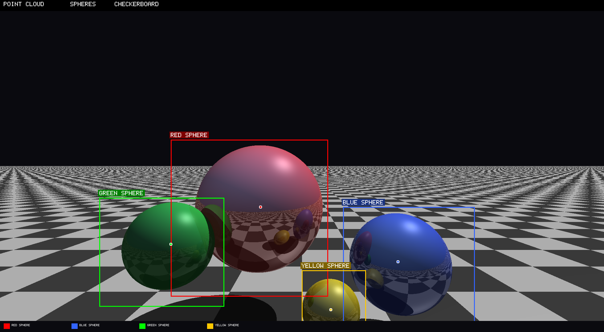

# C++ 3D Ray Tracer → Point Cloud Pipeline

A pure C++ pipeline that renders a 3D scene, extracts it as a point cloud, measures accuracy against ground-truth geometry, and draws 3D-aware bounding boxes — all with perspective-correct camera projection.



## Overview

```
  3D Scene          Ray Tracer           Point Cloud         Projector          Box Drawer
  (spheres +     →  casts rays       →  (x,y,z,R,G,B)    →  perspective     →  bounding boxes
   checkerboard)    per pixel            1,072,643 pts       back to 2D         on image
```

## Pipeline

| Step | Program | Input | Output | Description |
|------|---------|-------|--------|-------------|
| 1 | `raytracer.cpp` | — | `test.png` | Ray-traces 4 spheres + checkerboard plane |
| 2 | `pointcloud.cpp` | — | `test.ply` (+ accuracy report) | Same ray tracer, also exports every surface hit as a 3D point with color |
| 3 | `project_pc.cpp` | `test.ply` | `pointcloud.png` | Reads PLY, reverse-projects 3D points back through the **same camera** to 2D |
| 4 | `draw_boxes.cpp` | `pointcloud.png` (PPM) | `pointcloud_boxed.png` | Projects sphere bounding volumes to 2D rectangles, draws them |

## Scene

| Object | Center (x,y,z) | Radius | Color | Reflectivity |
|--------|---------------|--------|-------|-------------|
| Red sphere | (−1.0, 0.5, 5.0) | 1.5 | `#E63333` | 40% |
| Blue sphere | (2.0, −0.5, 4.0) | 1.0 | `#334DE6` | 30% |
| Green sphere | (−2.5, 0.0, 3.5) | 0.8 | `#33CC4D` | 10% |
| Yellow sphere | (0.5, −1.0, 3.0) | 0.5 | `#E6CC1A` | 20% |
| Checkerboard | y = −2 | ∞ (plane) | Grey/white tiles | 0% |

**Camera:** position (0, 1.5, −2), 60° FOV, 1960×1080 resolution  
**Light:** directional from (5, 10, 3) with hard shadows

## Accuracy

Since the scene is defined analytically (sphere equations `|P − C| = r`), every point cloud sample can be compared to the exact surface. The error is the perpendicular distance from the sampled point to the ideal geometry.

```
Surface                     Points    Mean Error     RMS Error     Max Error
───────────────────────────────────────────────────────────────────────────
Red sphere                  129,975   2.0×10⁻¹⁵      2.5×10⁻¹⁵     9.5×10⁻¹⁵
Blue sphere                  87,038   2.9×10⁻¹⁵      3.6×10⁻¹⁵     1.3×10⁻¹⁴
Green sphere                 67,402   3.4×10⁻¹⁵      4.2×10⁻¹⁵     1.6×10⁻¹⁴
Yellow sphere                27,419   4.6×10⁻¹⁵      5.7×10⁻¹⁵     2.1×10⁻¹⁴
Checkerboard                760,809   9.2×10⁻¹⁷      2.0×10⁻¹⁶     4.4×10⁻¹⁶
───────────────────────────────────────────────────────────────────────────
OVERALL                  1,072,643   8.7×10⁻¹⁶      1.9×10⁻¹⁵     2.1×10⁻¹⁴
```

Errors are at the level of **double-precision floating-point epsilon** (~10⁻¹⁵). This is the theoretical lower bound — the only error sources are `sqrt()` and arithmetic rounding in the ray-sphere intersection formula.

## How the camera projection works

Both the forward ray tracer and the reverse projector use the same perspective model. This is what makes the point cloud re-projection pixel-accurate:

### Forward (pixel → 3D)
Used by `raytracer.cpp` and `pointcloud.cpp`:
```cpp
double px = (2.0*(x+0.5)/WIDTH - 1.0) * tan(FOV/2) * ASPECT;
double py = (1.0 - 2.0*(y+0.5)/HEIGHT) * tan(FOV/2);
Ray ray(camera, Vec3(px, py, 1));  // direction into the scene
```

### Reverse (3D → pixel)
Used by `project_pc.cpp` and `draw_boxes.cpp`:
```cpp
double cx = world.x - camera.x;
double cy = world.y - camera.y;
double cz = world.z - camera.z;
double px = cx / cz;   // perspective division
double py = cy / cz;
int pixel_x = (px*SX + 1.0) * 0.5 * WIDTH - 0.5;
int pixel_y = (1.0 - py*SY) * 0.5 * HEIGHT - 0.5;
```

where `SX = 1/(tan(FOV/2)*ASPECT)`, `SY = 1/tan(FOV/2)`.

### Bounding box projection

For each sphere, the program samples **300 points on the sphere surface** (Fibonacci lattice) plus the **8 AABB corners**, projects all to 2D, then takes the min/max extent:

```
3D sphere surface points  →  perspective projection  →  2D bounding rectangle
      (Fibonacci)                (same camera)              (x1,y1)-(x2,y2)
```

## Build & Run

### Prerequisites
- **g++** (Ubuntu 9.4+, or any C++11 compiler)
- **Python 3** + **Pillow** (only for PPM → PNG conversion)

```bash
# Install dependencies on Ubuntu
sudo apt install g++ python3-pip
pip3 install Pillow
```

### Full pipeline

```bash
# Step 1: Render scene → PNG + PLY point cloud
g++ -O3 -o pointcloud pointcloud.cpp && ./pointcloud
python3 -c "from PIL import Image; Image.open('test.ppm').save('test.png')" && rm test.ppm

# Step 2: Project point cloud back to 2D
g++ -O3 -o project_pc project_pc.cpp && ./project_pc
python3 -c "from PIL import Image; Image.open('projected.ppm').save('pointcloud.png')" && rm projected.ppm

# Step 3: Draw bounding boxes
g++ -O3 -o draw_boxes draw_boxes.cpp
# (needs projected.ppm from step 2 — re-run project_pc without deleting it)
./project_pc && ./draw_boxes
python3 -c "from PIL import Image; Image.open('boxed.ppm').save('pointcloud_boxed.png')" && rm boxed.ppm projected.ppm
```

### Quick start (Hello World test)
```bash
g++ -o test test.cpp && ./test
# Output: Hello World!
```

## Files

### Source code
| File | Language | Purpose |
|------|----------|---------|
| `test.cpp` | C++ | Hello World environment test |
| `raytracer.cpp` | C++ | Original ray tracer with lighting, shadows, reflections |
| `pointcloud.cpp` | C++ | Ray tracer + PLY exporter + accuracy analyzer |
| `project_pc.cpp` | C++ | PLY reader + perspective projector + z-buffer |
| `draw_boxes.cpp` | C++ | PPM reader, sphere bbox projector, rectangle/label drawer |
| `draw_boxes.py` | Python | Same as above (reference implementation) |
| `visualize_pc.py` | Python | Matplotlib 3D scatter plot of PLY point cloud |

### Output
| File | Format | Size | Description |
|------|--------|------|-------------|
| `test.png` | PNG | 213 KB | Ray-traced render (1960×1080) |
| `test.ply` | PLY ASCII | 41 MB | Point cloud: 1,072,643 points with (x,y,z,R,G,B) |
| `pointcloud.png` | PNG | 171 KB | Point cloud re-projected from 3D (pixel-identical to test.png on surfaces) |
| `pointcloud_boxed.png` | PNG | 179 KB | Point cloud with 3D-aware colored bounding boxes |
| `test_boxed.png` | PNG | 230 KB | Original render with same bounding boxes |
| `comparison_boxed.png` | PNG | 275 KB | Side-by-side: original vs point cloud |
| `diff.png` | PNG | 7.8 KB | Pixel difference map (×10 amplification) |

## Key design decisions

**Why PPM as intermediate format?**  
PPM (Portable Pixmap, `P3` ASCII) requires no libraries — just `std::ofstream`. Each pixel is three space-separated integers. C++ reads/writes it natively; Python/Pillow converts it to compressed PNG for distribution.

**Why the point cloud has no sky pixels?**  
The point cloud only contains surface intersection points. Sky rays never hit geometry, so they produce no points. This is why `pointcloud.png` has dark regions where the sky should be — only ~50% of pixels hit a surface.

**Why is the accuracy so good?**  
The scene uses analytical surfaces (implicit sphere equations). The ray-sphere intersection formula `|O + t·D − C|² = r²` reduces to a quadratic whose solution is limited only by IEEE 754 double precision. There's no tessellation, no mesh approximation, no sensor noise.

## License

MIT
